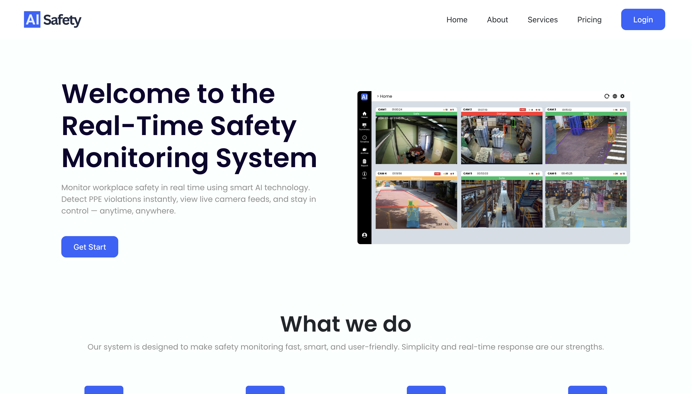
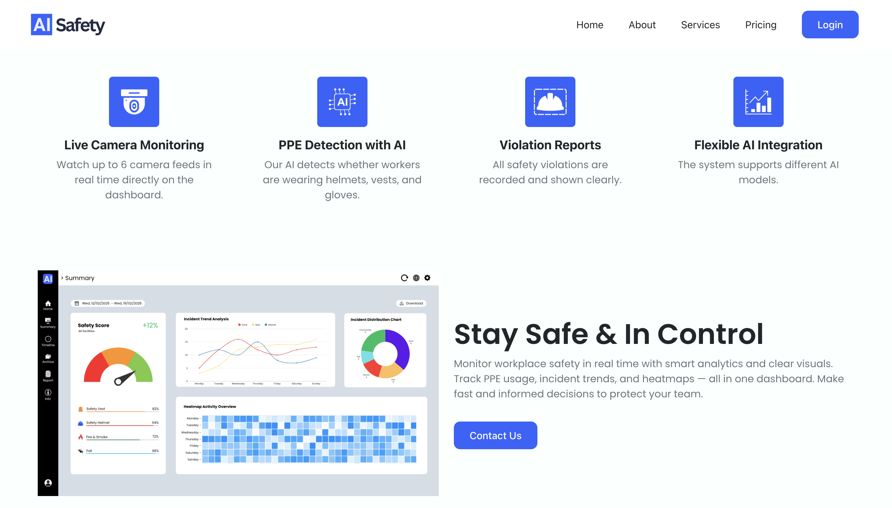
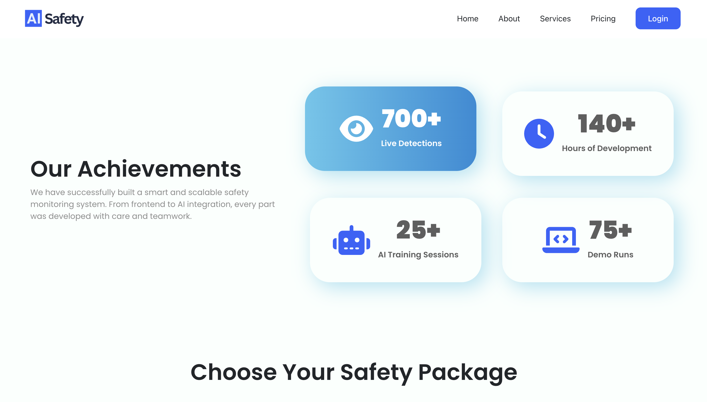
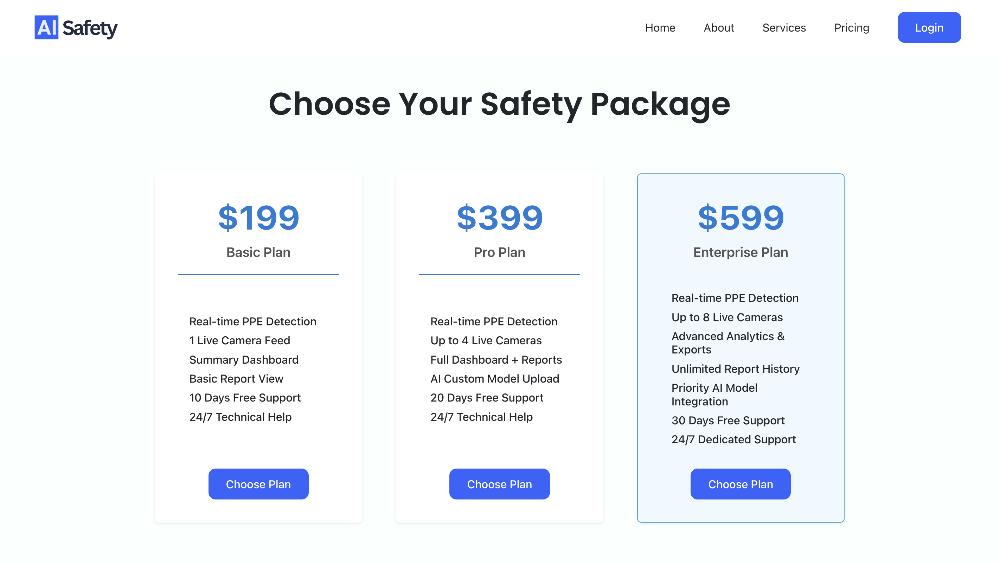
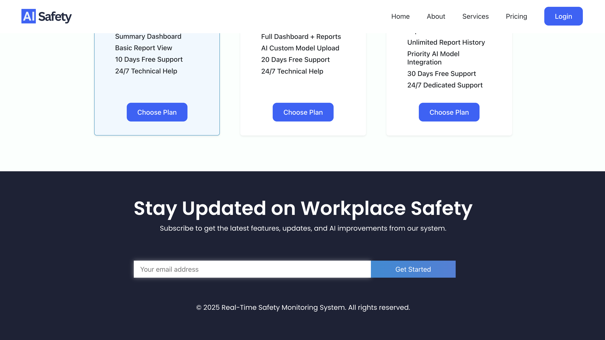

# 🌐 Welcome Page – Real-Time Safety Monitoring System

This project is a **Welcome/Landing Page** for the *Real-Time Safety Monitoring System* web app. It's designed to impress visitors with engaging visuals, structured sections, and smooth scrolling experience using modern web technologies.

## 🔍 Overview

The Welcome Page serves as the introduction to our Web Software project. It highlights the purpose of the system, our achievements, and available pricing packages. This page sets the tone for user interaction and engagement.

## ✨ Key Sections

- 🔵 **Banner** – Hero section with animated heading and image
- 🧩 **About** – Summary of what we do with custom cards
- 🏆 **Services** – Achievements with icons and animated layout
- 💰 **Pricing** – Tiered plans for potential clients
- 📬 **Contact** – Newsletter form and footer with social links

## 🧑‍💻 Technologies Used

- **React.js** (Component-based architecture)
- **React Router DOM** (Routing)
- **Bootstrap 5** (Responsive grid and layout)
- **Font Awesome** (Icons)
- **Custom CSS** (Styling & transitions)

## 📸 Screenshots

> 📂 Place your screenshots inside `/screenshots` folder.

### 1. 🖼 Banner Section  


### 2. 📖 About Section  


### 3. 🎯 Services Section  


### 4. 💳 Pricing Section  


### 5. 📞 Contact Section  



```bash
git clone https://github.com/abbosaliboev/WelcomePage.git

🚀 How to Run the Project Locally

After cloning, follow these steps to run the project on your local machine:

# 1. Navigate to the project folder
cd WelcomePage

# 2. Install dependencies
npm install

# 3. Start the development server
npm start

The project will run on:
👉 http://localhost:3000

⸻

📁 Folder Structure (Simplified)

src/
├── Components/
│   ├── Home/
│   │   ├── About/
│   │   ├── Banner/
│   │   ├── Contact/
│   │   ├── Pricing/
│   │   ├── Services/
│   │   └── NavBar/
├── images/
├── App.js
└── index.js


